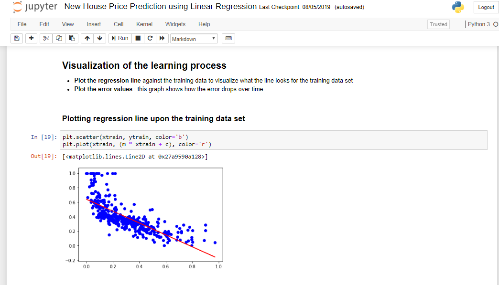

# New House Price Prediction

A Linear Regression ML model to predict the monetary value of a new house

## Getting Started

These instructions will get you a copy of the project up and running on your local machine for development and testing purposes. To get a local copy up and running follow these simple example steps.

### Prerequisites

* python 3.6

```
sudo apt-get install python3.6
```
* jupyter notebook

```
sudo apt install jupyter
```

### Installation

1. Clone the repo
```
git clone https://github.com/aashish157/New-House-Price-Prediction.git
```


### Usage

<div class="row col-md-12">
	<div class="row col-md-4">
		
	</div>
	<div class="row col-md-4">
		
	</div>
	<div class="row col-md-4">
		
	</div>
</div>


## Deployment

Add additional notes about how to deploy this on a live system

## Built With

* [Jupyter Notebook](https://jupyter.org/) - Python IDE
* [Python 3.6.8](https://www.python.org/) - Programming language used

## Contributing

Contributions are what make the open source community such an amazing place to be learn, inspire, and create. Any contributions you make are **greatly appreciated**.

1. Fork the Project
2. Create your Feature Branch 
3. Commit your Changes
4. Push to the Branch
5. Open a Pull Request

## Authors

* **Aashish Raj Gupta** - [aashish157](https://github.com/aashish157)


